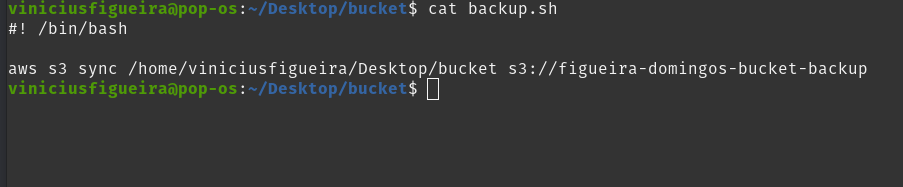
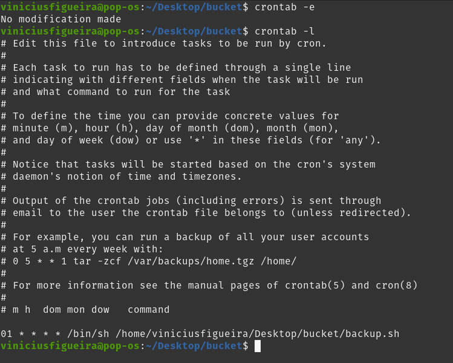

Subindo um Bucket S3 com script de sincronização local para o bucket

Pré Requisitos
1. AWS CLI
2. Terraform
3. Conta AWS com permissões necessárias para criação de um bucket
4. Para rotina de sincronização deve utilizar ambientes linux para usar o Cron
Inicio

Para criarmos o bucket basta acessar o diretorio e renomear o bucket com um nome válido
Lembrando que o nome do bucket tem que ser único no mundo todo.

Após selecionar o nome de seu bucket podemos irá executar os seguintes comandos

$ terraform init
$ terraform auto-approve

Após isso você terá seu bucket provisionado na S3

Para realizar a sincronização e backup dos seus dados locais basta editar o script com o repositório e bucket correspondente, e rodar o script "backup.sh"

Para que o script rode de forma automática basta adicionar o mesmo no Crontab da seguinte forma:

No seu terminal execute o comando 

$ crontab -e       #Este comando abre o arquivo para edição

Irá selecionar o editor de sua preferência

Após abrir o arquivo basta colocar essa linha para execução e salvar

$  01 * * * * /bin/sh /home/viniciusfigueira/Desktop/bucket/backup.sh       #Neste caso o script irá rodar a cada 1 minuto sincronizando os arquivos

*Para não ter problemas de execução de permissão para o arquivo backup.sh com o comando CHMOD
